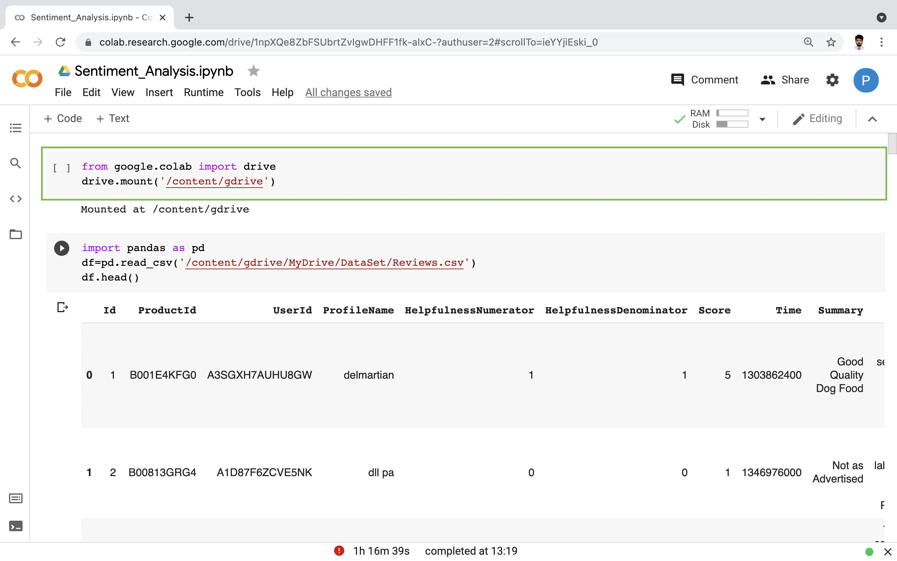
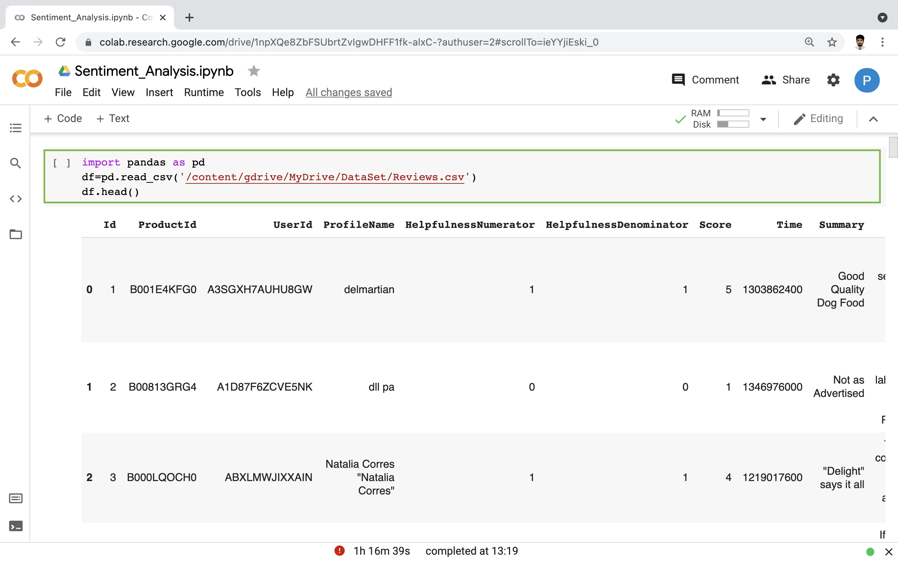
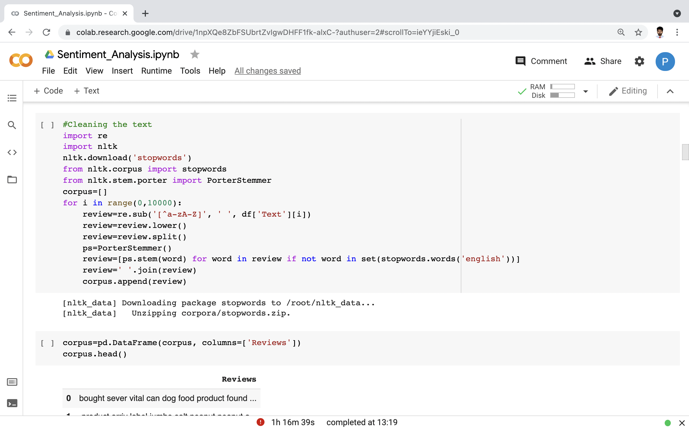
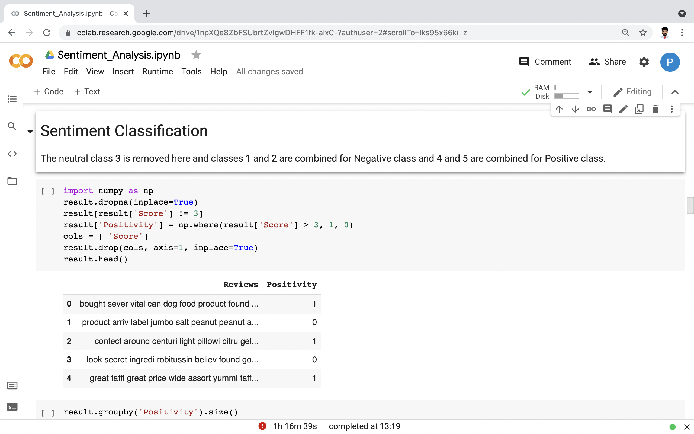
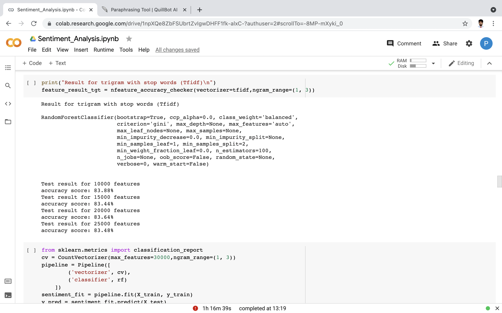
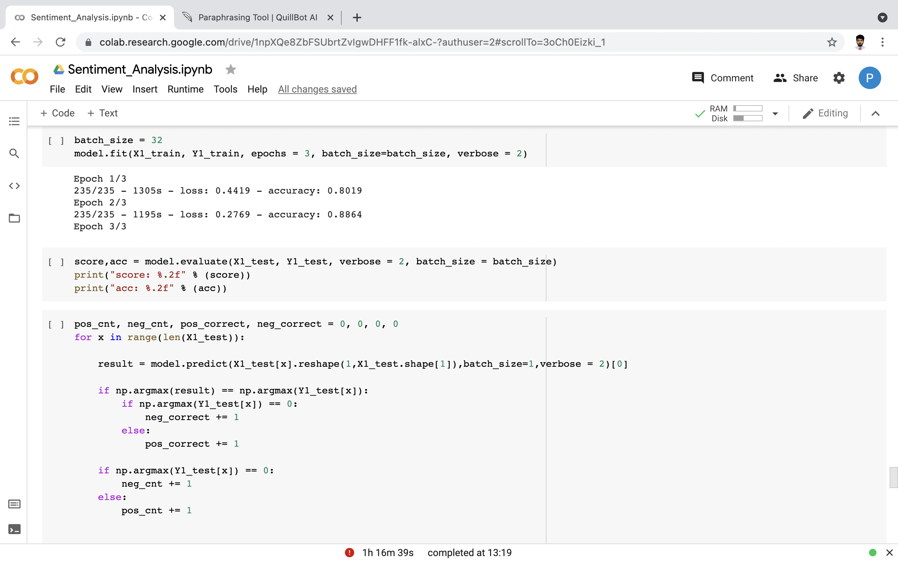

<h1 align="center"> Sentiment Analysis using Natural Language Processing </h1>

<p align="center">
    <a href=" " title="Sentiment Analysis">View Demo</a>
    ·
    <a href="https://github.com/prithvi-jhala/Sentiment_Analysis_Using_Natural_Language_Processing" title="Sentiment Analysis">Repository</a>
    ·
    <a href="https://github.com/prithvi-jhala/Sentiment_Analysis_Using_Natural_Language_Processing/blob/main/Project_Report.pdf" title="Sentiment Analysis">Report</a>
</p>


## Table of Contents

1. [Introduction](#introduction)
2. [Manifest](#manifest)
3. [Prerequisites](#prerequisites)
4. [Stepwise Implementation](#stepwise-implementation)
5. [Future Work](#future-work)
6. [Project Status](#project-status)
7. [Acknowledgements](#acknowledgements)


## Introduction

This project is an implementation of Sentiment Analysis using Natural Language Processing. Brief explanation of the concepts Sentiment Analysis and Natural Language Processing can be found in the Report. This code can be used by any organization as a backend code which needs to perform Sentiment Analysis for business purposes. The dataset I used in this code is "Amazon Fine Food Reviews", but Sentiment Analysis can be run on any dataset like Twitter data, Social media comments, Movie Reviews, etc. These datasets are available on Kaggle.com. 

According to the datasets used, the code needs to be edited as per requirements. The steps followed in this project are generalised and should be followed in any project including Sentiment Analysis, the techniques used may vary according to needs of the organization using this. The accuracy may also vary according to the models used to perform Sentiment Analysis.


## Manifest

```
- Sentiment_Analysis.ipynb --> Python file in which the project code is implemented.
<<<<<<< HEAD
<<<<<<< HEAD
- Reviews.CSV --> Link containing the dataset file (https://www.kaggle.com/snap/amazon-fine-food-reviews). 
=======
- Reviews.CSV --> File containing the Dataset. 
>>>>>>> parent of e05551a (Uploading the Dataset and the python code file to my repository.)
=======
- Reviews.CSV --> Link of the file containing the Dataset (https://www.kaggle.com/snap/amazon-fine-food-reviews). 
>>>>>>> 441c0bc0ccb99190f286758e423eb4ba52f815ac

```

## Prerequisites

You need to have basic Python knowlegde to understand the code in this project. Also, basic Machine Learning and Natural Language Processing knowledge is required to understand how this project works.

I have implemented this code using Google Colab, so there are no prerequistes as such, but if you want to run this code on your local system, you need to have the following items installed on your PC. 

- Python
- NLTK Library
- Keras
- TensorFlow
- Pandas
- NumPY
- MatplotLIB

## Stepwise Implementation

1. The following is the snapshot of my Google Colaboratory. First we have to mount our Google drive, in which we have to upload our Dataset file which would generally be in .csv or .json format. 



2. Then, to display the Dataset we are using Pandas Library. 



3. Pre-processing of the data is a crucial part of the data mining process. Knowledge discovery during the training phase is more challenging if there is a lot of irrelevant and repetitive information or noisy and inaccurate data. We have used Stemming, Lemmatization and Stop word Removal to Clean the data.



4. It is very difficult to classify a sentiment if we are using complex classes. So here we just have used 2 classes (Positive and Negative) to achieve maximum accuracy.



5. This snapshot shows the accuracy of different number of features we selected for the analysis.



6. This snapshot shows the final accuracy of the model after we trained it using Keras.



## Future Work

In this model, I have used only two classes (Positive and Negative) for the sentiment analysis for better accuracy. I will work on this project in future to improve the accuracy and increase the number of classes. I will add a class for a neutral sentiment, because customers can have a neutral review on a food product. And this model can be used in other datasets too, so I am working on creating a generalised UI for end users and I will add more than one datasets to the model to train it better, but that requires a large amount of RAM and processing power. Training the model using this very dataset took me around 5-6 hours, so if we add more datasets, then it will take a very long time to train the model. So using deep learning and neural network models, we can improve the accuracy by using more than one datasets.

## Project Status

Currently, I will not be working on this project for a few weeks, I will pick up after mid September to work on the things I mentioned in Future Work Section. Till then, everyone is welcome to review the code, Edit it and notify me and provide me with any suggestions or feedback for the code and the report, it would be really valuable to me.

 

## Acknowledgements

I would like to express my deepest appreciation to my course instructor, Dr. Trevor Tomesh, whose contribution in stimulating suggestions and encouragement, helped me to coordinate my project especially in writing the report. Dr. Trevor Tomesh helped me with the basic concepts of conducting a research and preparing a well formatted standard report document. It will be very useful to me in the future as well.


​    

